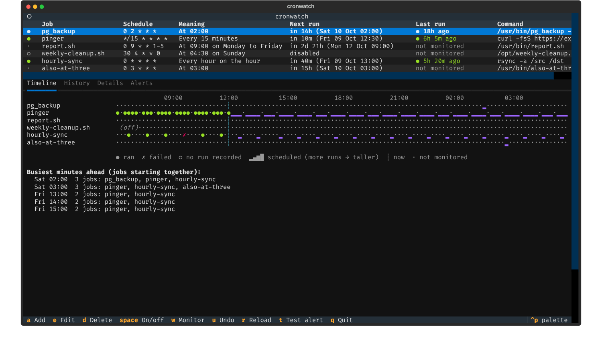
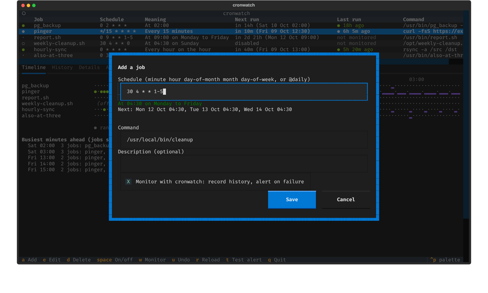

# Cron Job Visual Scheduler & Failure Alerter

**Category:** Practical Software
**Difficulty:** Intermediate
**Status:** Implemented (Python)

Source modules live in `src/cronwatch/`; the tests are in `tests/`.

`cronwatch` is a TUI for your real crontab, plus the two things cron never gave you: a **history** of what actually ran and what it printed, and **alerts** when a job fails or silently never starts. Edits go through `crontab -l` / `crontab -` (or a file, for trying things safely); the running pieces are a transparent wrapper (`cronwatch run`) and a missed-run checker (`cronwatch check`), both meant to be called from cron itself.





## Quick start

```bash
cd "challenges/Practical Software/Cron Job Visual Scheduler & Failure Alerter"
uv run cronwatch --help

CRONWATCH_CRONTAB=./try.crontab uv run cronwatch   # TUI on a scratch file, not your crontab
uv run cronwatch                                  # TUI on your real crontab
```

In the TUI: `a` add, `e` edit, `d` delete (asks first), `space` enable/disable, `w` wrap/unwrap a job with the monitor, `u` undo, `r` reload, `t` send a test alert, `1`-`4` Timeline / History / Details / Alerts, `q` quit.

| Command                                  | What it does                                                                                              |
| ---------------------------------------- | --------------------------------------------------------------------------------------------------------- |
| `cronwatch run --job ID [--timeout S] -- CMD...` | Run CMD like cron would; record start, end, exit status and output tail; alert per policy.         |
| `cronwatch list`                         | Jobs with plain-English schedule, next run and last result.                                              |
| `cronwatch history [--job ID] [--run N]` | Recent runs; `--run N` prints that run's captured output.                                                |
| `cronwatch timeline`                     | The visual timeline, non-interactively.                                                                   |
| `cronwatch check [--dry-run]`            | Find jobs that should have started and did not; alert. Run it from cron every few minutes.               |
| `cronwatch install-monitor`              | Add the `check` entry (and `CRONWATCH_HOME`) to the crontab for you.                                      |
| `cronwatch test-alert`                   | Send a test through every configured channel and say which worked.                                        |

## How monitoring works

Cron can't tell you a job failed; it only mails output, if mail is set up. `w` rewrites a job from

```cron
0 2 * * * /usr/bin/pg_backup --all | gzip > /b/dump.gz
```

to

```cron
0 2 * * * /path/to/cronwatch run --job pg_backup -- sh -c '/usr/bin/pg_backup --all | gzip > /b/dump.gz'
```

The whole original line goes inside `sh -c`, so pipes, `&&`, redirects and `$(...)` behave exactly as before. Unwrapping (`w` again) restores the original text byte for byte. Wrapping refuses a command with an unescaped `%` (cron turns it into a newline, so quoting it would change its meaning) and tells you to escape it.

### The wrapper is transparent, and can never break the job

* Output still reaches cron's stdout/stderr as it is produced, so `MAILTO` and `>> log 2>&1` keep working; the last 16 KiB are also kept in the history.
* The exit status passes through. A signal death reports `128+N`; `--timeout` kills the **whole process group** and exits `124`; a missing command is `127`, a non-executable one `126` (the same codes as the shell and `timeout(1)`).
* `SIGTERM`/`SIGINT`/`SIGHUP` sent to the wrapper are forwarded to the job's process group.
* **Cronwatch's own failures are warnings and never change the job's result:** an unwritable database, a broken `config.toml`, an unusable `CRONWATCH_HOME`, a dead webhook. The job always runs and its exit status is returned. (An end-to-end test found a violation of exactly this: an unusable home directory used to abort the wrapper before the job started.)
* `--ok-codes 0,24` marks chosen non-zero statuses as success (rsync's "files vanished").

### Missed runs, the failure nothing else catches

If the cron daemon is down, the machine was off, or the crontab line is malformed, no wrapper runs, so nothing fails and nothing alerts. `cronwatch check` compares what each monitored job's schedule says should have happened with what the history says did:

* A run counts for the scheduled minute it started at or shortly after (a `grace` of 5 minutes by default), but **never for a later one**, so a single late run cannot hide a separate miss.
* The first time a job is seen, counting starts from *now*, so a freshly added job is not accused of missing everything before it existed. Disabled jobs advance the cursor too, so re-enabling one does not "miss" its whole pause.
* After a long outage, at most 24 hours are examined and you get **one** alert per job per check, however many runs were missed.

### Alert policy: one alert per incident

A job failing every minute must not send a thousand emails (`alerts.py:decide`, a pure function with its own tests):

| Event                                        | Result                                                           |
| -------------------------------------------- | ---------------------------------------------------------------- |
| Failure number `alert_after` (default 1)     | `failed` alert                                                   |
| Further failures                             | silent, until `renotify_after` (default 6h) passes → `still-failing` |
| First success after an alert                 | one `recovered` alert (`recovery = false` to disable)            |
| A success without a prior alert              | silent                                                           |

## Configuration

`config.toml` next to the database (`CRONWATCH_HOME`, default: the project folder). **Cron's environment is minimal, so `install-monitor` writes `CRONWATCH_HOME=...` into the crontab**; put the same line above your wrapped jobs if you add them by hand.

```toml
[alerts]
alert_after = 1
renotify_after = "6h"
recovery = true
retention = "90d"        # history older than this is pruned
grace = "5m"             # how late a run may start before it counts as missed
timezone = "Europe/Berlin"   # schedule zone; default: the system zone

[alerts.webhook]
url_env = "CRONWATCH_WEBHOOK"   # or `url = "https://..."`; a URL is a credential, prefer the env var
format = "slack"                 # json | slack | discord
include_output = false           # job output can contain secrets and this channel is a third party

[alerts.email]
host = "smtp.example.com"
from = "cron@example.com"
to = ["ops@example.com"]
username = "cron"
password_env = "SMTP_PASSWORD"   # the password itself is rejected if it appears in this file
include_output = true

[alerts.desktop]
enabled = true                   # notify-send / osascript; often unavailable from cron (no desktop session)
```

Webhooks retry server errors, timeouts and HTTP 429 (but not other 4xx, which retrying cannot fix), one broken channel never blocks the others, and every delivery result is logged (Alerts tab). Delivery errors never contain a URL or credential.

## Design decisions

### The cron engine (`cronexpr.py`)

Follows Vixie cron, including the rule people trip over: **if both day-of-month and day-of-week are restricted, a day matches if *either* does** (`0 0 13 * 5` is "the 13th, *or* any Friday"). Also: `7` is Sunday, names, ranges, steps (`5/20` means 5-59 step 20), macros, `@reboot`. Invalid input says which field and why; schedules that never fire (`0 0 31 2 *`) are rejected; a backwards range suggests the two-range rewrite.

Times are wall-clock in a given zone, and daylight saving is handled deliberately and tested against the real US transitions: a time that does not exist (02:30 on the spring-forward day) does not fire; a repeated hour (fall-back) fires once, in its first pass. All arithmetic on durations is done in UTC, because Python's same-timezone `datetime` subtraction ignores the offset change (a 30-minute real gap across spring-forward subtracts as 90).

### The crontab is edited, not regenerated (`crontab.py`)

Every line is kept verbatim; only the line being edited is rewritten. Comments, `MAILTO=`, blank lines and even malformed lines survive a load/save cycle byte for byte (round-trip tested on a messy real-world fixture). Disabling a job is reversible (`#cronwatch:off# <original line>`); plain commented-out jobs are left alone. A comment directly above a job is its description, but delete only ever removes a note cronwatch itself wrote (`# cronwatch: ...`), never yours.

Writes go through a `Session` with a safety net:

* **Conflict detection.** The backend is re-read before every write; if it changed since load (you or another tool edited it), the write is refused and nothing is overwritten. `r` reloads.
* **A backup per write** in `backups/` (last 50 kept), and in-session **undo** (`u`).
* `crontab -` validates before replacing, so a bad entry leaves the old crontab intact, and the editor validates the schedule and command *before* anything is written.

### The preview is the editor

Typing a schedule shows what it means and its next three runs immediately (`At 04:30 on Monday to Friday / Next: Mon 12 Oct 04:30, ...`), which catches the classic mistakes (the either-rule above, a step that isn't what you meant) before they reach cron.

### The timeline (`timeline.py`)

One row per job, one column per time slice: history to the left of the `now` marker (`●` ran, `✗` failed, `○` scheduled but no run recorded), the schedule to the right (taller bars = more runs per slice). `○` is only drawn after a job was first monitored, so wrapping a job doesn't make its past look like a wall of misses. The summary names the minutes where several jobs start together, which is usually the thing worth moving.

## Architecture

| Module         | Responsibility                                                                                     |
| -------------- | -------------------------------------------------------------------------------------------------- |
| `cronexpr.py`  | Parse, next-run search with DST rules, plain-English description                                   |
| `crontab.py`   | Round-trip parse/edit, wrap/unwrap, file and system backends, safe-write `Session`                 |
| `store.py`     | SQLite (WAL, one short connection per call): runs, per-job alert state, alert log                  |
| `runner.py`    | The wrapper: process group, timeout, signal forwarding, output tail, never-break-the-job            |
| `alerts.py`    | Policy state machine, message rendering, webhook/email/desktop channels, dispatcher                |
| `monitor.py`   | Missed-run detection                                                                               |
| `timeline.py`  | Timeline model and Rich rendering                                                                  |
| `config.py`    | `config.toml` validation (rejects inline passwords)                                                |
| `app.py`       | Textual UI: job table, tabs, editor and confirm modals                                             |
| `cli.py`       | Typer commands                                                                                     |

Dependencies: Textual, Typer, Rich. Everything else (SQLite, HTTP, SMTP, TOML) is the standard library.

## Testing

```bash
uv run pytest -q # 240 tests, ~25 s
```

* **test_cronexpr.py**: every field type, the either-rule, leap days, 17 invalid-input messages, `describe()`, and spring-forward / fall-back behaviour in `America/New_York`.
* **test_crontab.py**: byte-exact round trip, edit isolation, toggle, wrap/unwrap (pipes, quotes, `\%`, wrapper paths with spaces), backends with a fake `crontab`, conflict detection, undo, backup pruning.
* **test_runner.py**: real subprocesses: pass-through, exit codes, timeout killing a *grandchild* process, `SIGKILL` and `SIGTERM` forwarding, missing/non-executable commands, a broken store, a failing channel, a closed output pipe.
* **test_alerts.py**: policy cases, and delivery against **a real local HTTP server and a real minimal SMTP server** (retries, 4xx handling, URL scrubbing, headers).
* **test_monitor.py**: first sighting, exact missed instants, grace, a late run not hiding a miss, long outages, paused jobs, idempotence.
* **test_timeline.py**, **test_display.py**, **test_store.py** (including six concurrent writer threads), **test_config.py**, **test_timeutil.py**.
* **test_cli.py**: the wrapper in a fresh `python -m cronwatch` process exactly as cron would start it, a webhook receiving `failed` once for three failures and `recovered` after the fix, and every command.
* **test_app.py**: Textual `Pilot` tests: listing, detail/history panes, toggle/delete/wrap/add/edit through the real file, validation, undo, an external-edit conflict resolved with `r`, test alerts, an empty crontab.

## Limitations

* **Unix only.** It needs `cron`/`crontab`. Per-user crontabs only (`-u` works with privileges); the system `/etc/crontab` and `cron.d` formats (which have a user field) are not edited.
* **Only wrapped jobs have history and missed-run detection.** Unwrapped jobs still appear, with their schedule, and are marked "not monitored".
* **Fall-back repeated hour:** a wildcard-hour job fires twice in the repeated hour in real cron; this predicts one. (Fixed-time jobs match real cron.)
* **History lives next to the database.** Two machines have two histories; there is no central server.
* **Desktop notifications from cron** usually have no session bus to talk to; webhook and email are the dependable channels.
* **A killed wrapper leaves a run stuck as `running`** (a power cut mid-job); the row is shown as such rather than guessed at.
* `%` in a command is only handled by refusing to wrap it, not by rewriting it.
